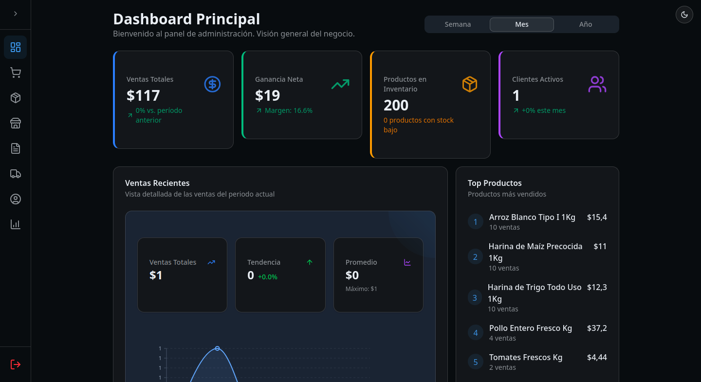
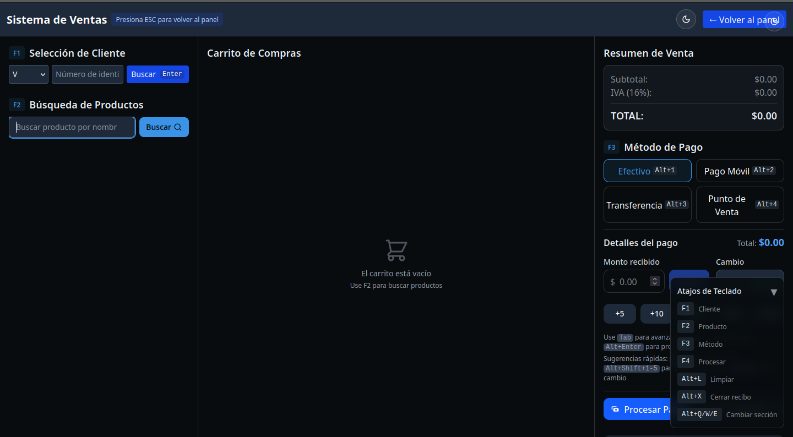
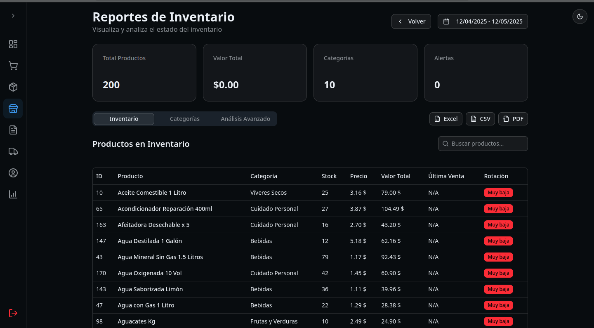
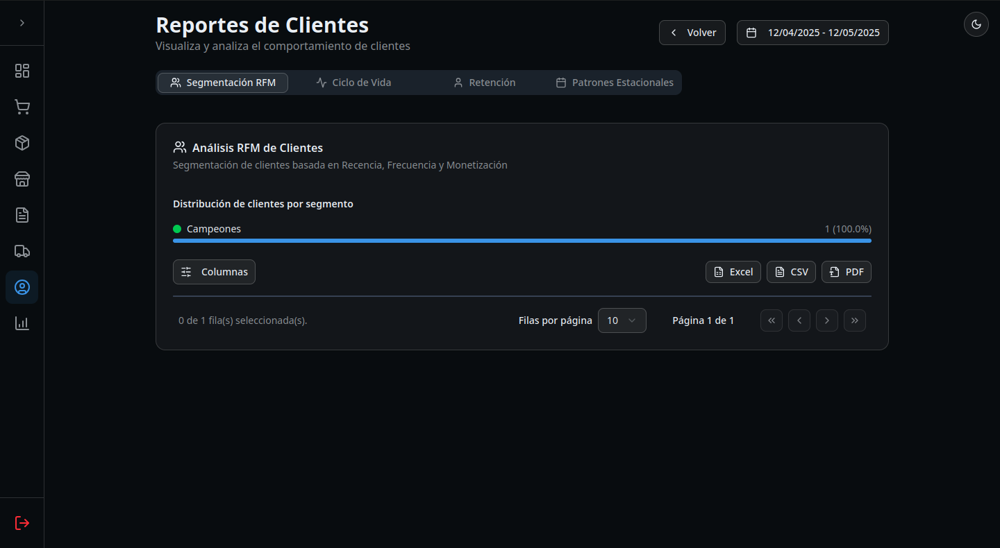

# Sistema POS - Punto de Venta Moderno

<p align="center">
  
</p>

Sistema POS es una aplicación completa de punto de venta desarrollada con Next.js, diseñada para optimizar y modernizar la gestión de ventas, inventario y clientes en comercios minoristas.

## ✨ Características Principales

- 🛒 **Módulo de Ventas**: Procesamiento rápido de transacciones con múltiples métodos de pago
- 📦 **Gestión de Inventario**: Control detallado de productos, categorías y proveedores
- 👥 **Gestión de Clientes**: Base de datos de clientes con historial de compras
- 📊 **Reportes Avanzados**: Visualizaciones y análisis detallados para la toma de decisiones
- 👤 **Gestión de Usuarios**: Control de acceso con roles de administrador y vendedor
- 🌙 **Modo Oscuro/Claro**: Interfaz adaptable a preferencias visuales
- ⌨️ **Operación por Teclado**: Atajos para operaciones rápidas sin necesidad de mouse

## 🖼️ Capturas de Pantalla

<p align="center">
  
  
</p>
<p align="center">
  
  
</p>

## 🚀 Instalación y Configuración

### Requisitos Previos

- Node.js 18.x o superior
- PostgreSQL 14.x o superior
- npm o yarn

### Pasos de Instalación

1. Clonar el repositorio:
   ```bash
   git clone https://github.com/tu-usuario/pos-system.git
   cd pos-system
   ```

2. Instalar dependencias:
   ```bash
   npm install
   # O usando yarn
   yarn install
   ```

3. Configurar variables de entorno:
   - Copia el archivo `.env.example` a `.env`
   - Actualiza las variables según tu entorno

4. Configurar la base de datos:
   ```bash
   npx prisma migrate dev
   # Opcionalmente, para datos de ejemplo
   npm run prisma:seed
   ```

5. Iniciar el servidor de desarrollo:
   ```bash
   npm run dev
   # O usando yarn
   yarn dev
   ```

6. Acceder a la aplicación:
   - Abre [http://localhost:3000](http://localhost:3000) en tu navegador

## 💻 Tecnologías Utilizadas

- **Frontend**: 
  - [Next.js 15](https://nextjs.org/) - Framework de React
  - [TypeScript](https://www.typescriptlang.org/) - Superconjunto tipado de JavaScript
  - [TailwindCSS](https://tailwindcss.com/) - Framework CSS utilitario
  - [Radix UI](https://www.radix-ui.com/) - Componentes accesibles y sin estilos

- **Backend**:
  - [Next.js API Routes](https://nextjs.org/docs/api-routes/introduction) - API serverless
  - [Prisma](https://www.prisma.io/) - ORM para TypeScript y Node.js
  - [PostgreSQL](https://www.postgresql.org/) - Base de datos relacional

- **Herramientas y Utilidades**:
  - [React Hook Form](https://react-hook-form.com/) - Manejo de formularios
  - [Zod](https://github.com/colinhacks/zod) - Validación de esquemas
  - [Nivo](https://nivo.rocks/) / [Recharts](https://recharts.org/) - Visualización de datos
  - [ExcelJS](https://github.com/exceljs/exceljs) / [jsPDF](https://github.com/parallax/jsPDF) - Exportación de datos

## 📖 Documentación

La documentación completa está disponible en la carpeta [docs](/docs):

- [Manual del Usuario](/docs/user-manual.md)
- [Guía para Administradores](/docs/admin-guide.md)
- [Guía para Vendedores](/docs/seller-guide.md)
- [Referencia API](/docs/api-reference.md)
- [Guía de Desarrollo](/docs/development.md)
- [Atajos de Teclado](/docs/keyboard-shortcuts.md)

## 🏗️ Estructura del Proyecto

```
pos-system/
├── prisma/                 # Configuración de base de datos y migraciones
├── public/                 # Archivos estáticos
├── src/
│   ├── app/                # Rutas y páginas de Next.js (App Router)
│   ├── components/         # Componentes globales
│   │   ├── ui/             # Componentes de UI reutilizables
│   │   ├── forms/          # Componentes de formulario
│   │   └── layout/         # Componentes de diseño
│   ├── features/           # Funcionalidades agrupadas por dominio
│   │   ├── sales/          # Feature de ventas
│   │   ├── inventory/      # Feature de inventario
│   │   ├── customers/      # Feature de clientes
│   │   └── reports/        # Feature de reportes
│   ├── lib/                # Utilidades y lógica compartida
│   │   ├── api/            # Funciones auxiliares para APIs
│   │   ├── auth/           # Lógica de autenticación
│   │   ├── db/             # Configuración de base de datos
│   │   └── utils/          # Funciones de utilidad
│   ├── types/              # Definiciones de tipos TypeScript
│   └── middleware.ts       # Middleware de Next.js
└── docs/                   # Documentación adicional
```

## ⚙️ Configuración Avanzada

### Variables de Entorno

El sistema utiliza las siguientes variables de entorno principales:

- `DATABASE_URL`: URL de conexión a la base de datos PostgreSQL
- `SECRET_KEY`: Clave secreta para la autenticación
- `NODE_ENV`: Entorno de ejecución (development, production)

Consulta el archivo [`.env.example`](.env.example) para ver todas las variables disponibles.

### Personalizaciones

El sistema puede personalizarse mediante:

- **Temas**: Configuración de colores y estilos en `src/lib/config/theme.ts`
- **Impresión**: Ajustes de formato de recibos en `src/features/sales/config/receipt.ts`
- **Reportes**: Configuración de visualizaciones en `src/features/reports/config/reports.ts`

## 👥 Contribución

¡Las contribuciones son bienvenidas! Si deseas contribuir:

1. Haz un fork del repositorio
2. Crea una rama para tu feature (`git checkout -b feature/amazing-feature`)
3. Haz commit de tus cambios (`git commit -m 'feat: add amazing feature'`)
4. Haz push a la rama (`git push origin feature/amazing-feature`)
5. Abre un Pull Request

Consulta la [guía de contribución](docs/CONTRIBUTING.md) para más detalles.

## 📄 Licencia

Este proyecto está licenciado bajo la Licencia MIT - consulta el archivo [LICENSE](LICENSE) para más detalles.

## 📧 Contacto

Para soporte, preguntas o sugerencias, por favor contacta a través de:

- Email: soporte@sistema-pos.com
- [Crear un Issue](https://github.com/tu-usuario/pos-system/issues)
